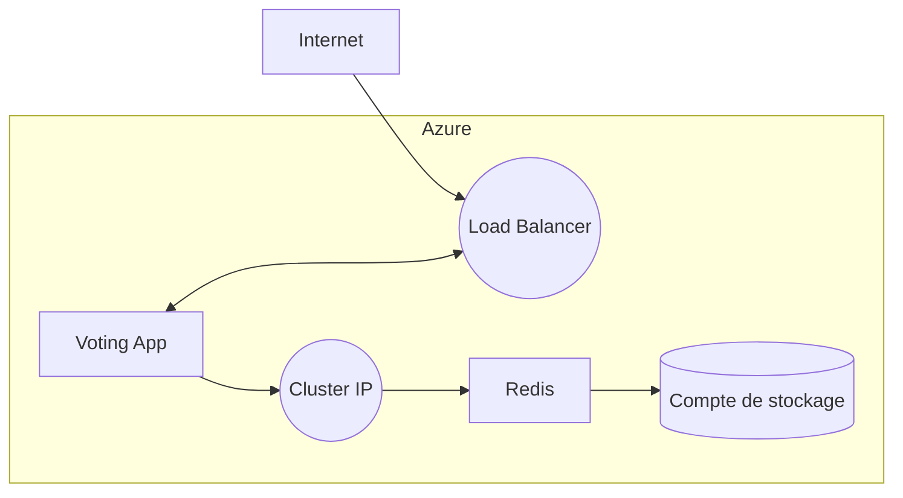
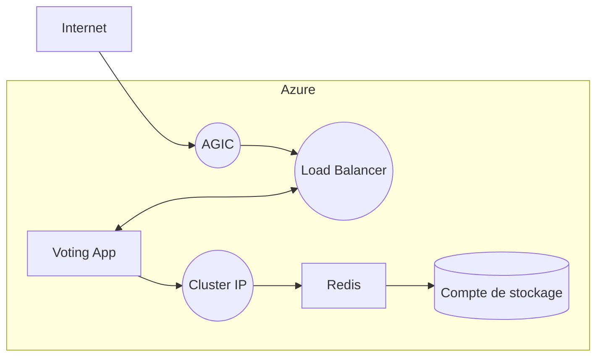
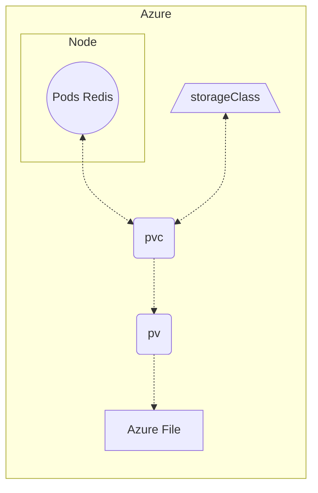

# DAT Brief_6

## Objectif

Déployer l’application de vote avec une base de donnée redis, un stockage persistant pour la base de donnée.
Cette dernière doit être disponible via notre zone DNS en passant par une Application Gateway.

## Solution 

Utilisation d’Ingress de Kubernetes, obtention d’un nom de domaine via Gandi.

## Topologie

### Part 1

### Part 2

## Ressources

- 1 groupe de ressources
- 1 cluster AKS
- 4 Noeuds 
- 1 AZURE GATEWAY
- + AGIC (Part 2)

## Stockage 

